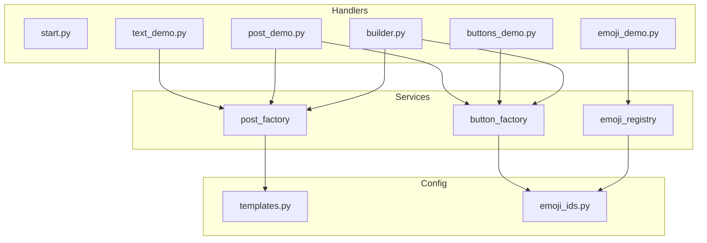
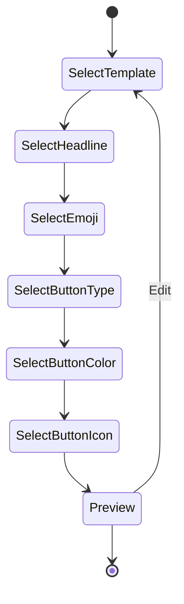
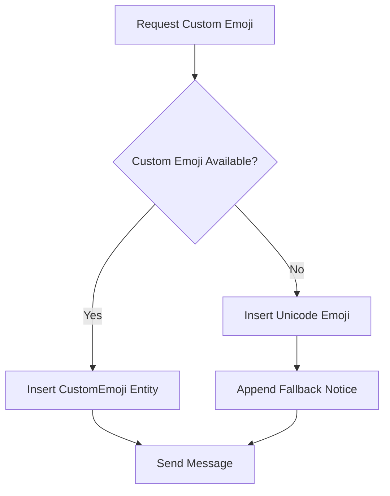
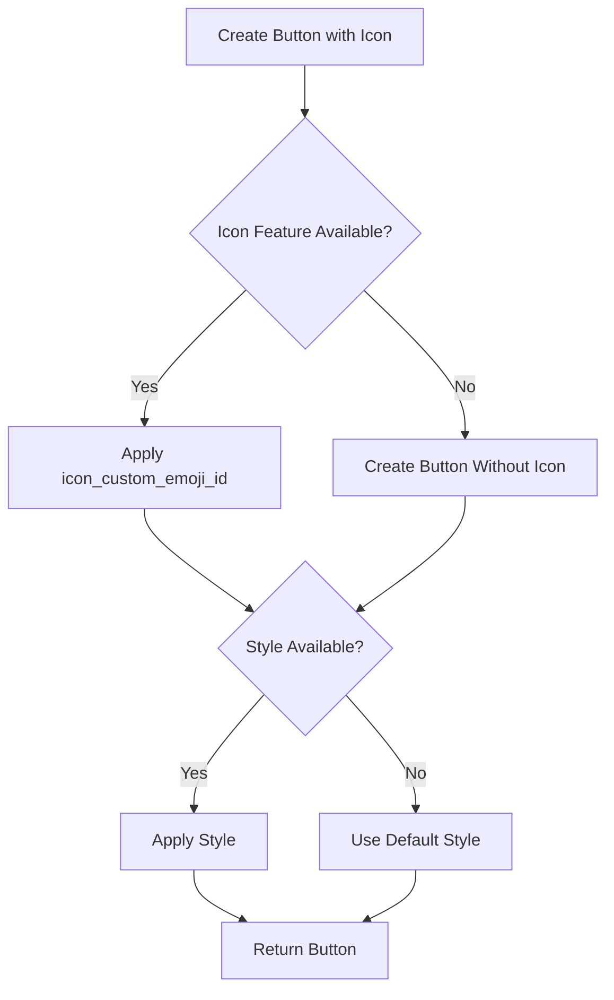
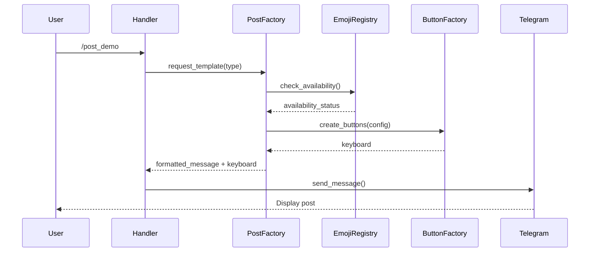

# Post Styling Demo Bot - Design Document

## 1. Overview

A Telegram bot built with aiogram 3.25.0 demonstrating post styling and visual message presentation capabilities:
- Rich text formatting
- Custom emoji in messages
- Colored buttons (primary/success/danger)
- Buttons with emoji icons
- Fallback mechanisms for unsupported features

## 2. Architecture

### 2.1 Project Structure

```
project_root/
├── bot.py                      # Entry point
├── config/
│   ├── settings.py             # Bot configuration
│   ├── templates.py            # Post templates definitions
│   └── emoji_ids.py            # Custom emoji ID registry
├── handlers/
│   ├── start.py                # /start, /menu, /help
│   ├── text_demo.py            # /text_demo
│   ├── post_demo.py            # /post_demo
│   ├── emoji_demo.py           # /emoji_demo
│   ├── buttons_demo.py         # /buttons_demo
│   └── builder.py              # /builder interactive constructor
├── services/
│   ├── post_factory.py         # Post assembly service
│   ├── button_factory.py       # Button creation service
│   └── emoji_registry.py       # Emoji availability checker
├── keyboards/
│   ├── menu.py                 # Main menu keyboards
│   └── builder_kb.py           # Builder step keyboards
└── utils/
    └── fallback.py             # Fallback detection utilities
```

### 2.2 Component Diagram



## 3. Commands

| Command | Description |
|---------|-------------|
| `/start` | Welcome message with main menu |
| `/menu` | Display main navigation menu |
| `/text_demo` | Text formatting demonstrations |
| `/post_demo` | Ready-made post templates |
| `/emoji_demo` | Custom vs Unicode emoji comparison |
| `/buttons_demo` | Button styles and icons demo |
| `/builder` | Interactive post constructor |
| `/help` | Command reference |

## 4. Module Specifications

### 4.1 Text Demo Module (`/text_demo`)

Sends sequential messages demonstrating:

| Message | Content |
|---------|---------|
| Basic Post | Plain text message |
| Combined Styles | Bold + italic + underline combinations |
| Quote Post | Standard blockquote formatting |
| Expandable Quote | Collapsible blockquote |
| Links Post | Text links with hyperlinks |
| Custom Emoji Post | Message with custom emoji entities |

**Text Formatting Support:**

| Format | Implementation |
|--------|----------------|
| Bold | `Bold("text")` |
| Italic | `Italic("text")` |
| Underline | `Underline("text")` |
| Strikethrough | `Strikethrough("text")` |
| Spoiler | `Spoiler("text")` |
| Inline Code | `Code("text")` |
| Code Block | `Pre("code", language="python")` |
| Text Link | `TextLink("text", url="...")` |
| Blockquote | `BlockQuote("text")` |
| Expandable Quote | `BlockQuote("text", expandable=True)` |
| Custom Emoji | `CustomEmoji("placeholder", custom_emoji_id="...")` |

### 4.2 Post Demo Module (`/post_demo`)

Five template types:

| Template | Components |
|----------|------------|
| **Announcement** | Headline (bold) + accent text (italic) + link + neutral buttons |
| **Promo** | Custom emoji + bullet list + primary CTA button |
| **Update** | Blockquote + list items + primary action button |
| **Warning/Alert** | Bold warning text + danger (red) button |
| **Success/Result** | Success message + success (green) button |

### 4.3 Emoji Demo Module (`/emoji_demo`)

Displays three message variants:

1. **Unicode-only post** - Standard emoji characters
2. **Custom emoji post** - Using `CustomEmoji` entities with `custom_emoji_id`
3. **Mixed post** - Combination of both types

Each post includes a technical footer showing:
- Custom emoji IDs used
- Fallback status indicator

### 4.4 Buttons Demo Module (`/buttons_demo`)

Demonstrates inline keyboard variations:

| Demo | Description |
|------|-------------|
| Unstyled buttons | Default inline buttons |
| Primary style | Blue buttons (`style="primary"`) |
| Success style | Green buttons (`style="success"`) |
| Danger style | Red buttons (`style="danger"`) |
| Icon buttons | Buttons with `icon_custom_emoji_id` |
| Icon + Color + Callback | Combined styling with callback action |
| Icon + Color + URL | Combined styling with external link |
| Icon + Color + Switch | Combined styling with inline query switch |

### 4.5 Builder Module (`/builder`)

Interactive FSM-based post constructor:



**Builder Steps:**

| Step | Options |
|------|---------|
| Template Type | Announcement / Promo / Update / Warning / Success |
| Headline Format | Plain / Bold / Italic / Bold+Italic |
| Custom Emoji | Yes / No |
| Button Type | Inline / Reply / None |
| Button Color | Primary / Success / Danger / None |
| Button Icon | Yes / No |

## 5. Services

### 5.1 Post Factory Service

**Responsibilities:**
- Assemble formatted messages using `aiogram.utils.formatting`
- Apply text styles based on template configuration
- Insert custom emoji entities when available
- Generate fallback content when features unavailable

### 5.2 Button Factory Service

**Responsibilities:**
- Create `InlineKeyboardMarkup` with style parameters
- Create `ReplyKeyboardMarkup` with icon support
- Apply `icon_custom_emoji_id` when conditions met
- Generate fallback buttons without icons/styles

**Button Style Mapping:**

| Style Name | Visual Result |
|------------|---------------|
| `primary` | Blue button |
| `success` | Green button |
| `danger` | Red button |

### 5.3 Emoji Registry Service

**Responsibilities:**
- Store custom emoji ID mappings
- Check emoji availability
- Provide Unicode fallback alternatives
- Track which emoji were used in messages

## 6. Fallback Logic

### 6.1 Emoji Fallback Flow



**Fallback Notice Text:** `"ℹ️ Custom emoji fallback enabled"`

### 6.2 Button Fallback Flow



### 6.3 Availability Conditions

| Feature | Availability Condition |
|---------|------------------------|
| Custom emoji in text | Bot owner has Telegram Premium OR bot has additional usernames on Fragment |
| `icon_custom_emoji_id` on buttons | Same conditions as custom emoji in text |
| Button styles (primary/success/danger) | Client support (graceful degradation) |

## 7. Configuration

### 7.1 Settings Configuration

| Parameter | Description |
|-----------|-------------|
| `BOT_TOKEN` | Telegram bot token |
| `CUSTOM_EMOJI_ENABLED` | Flag to enable/disable custom emoji features |
| `FALLBACK_ENABLED` | Enable automatic fallback behavior |

### 7.2 Templates Configuration

Each template defines:
- Headline text and format
- Body content structure
- Emoji placeholders (custom ID + Unicode fallback)
- Button configuration (text, action, style, icon)

### 7.3 Emoji Registry Configuration

Mapping structure:

| Key | Custom Emoji ID | Unicode Fallback |
|-----|-----------------|------------------|
| `fire` | `5368324170671202286` | 🔥 |
| `check` | `5409099013373066849` | ✅ |
| `warning` | `5413879192267805083` | ⚠️ |
| `star` | `5368324170671202287` | ⭐ |

## 8. Menu Structure

### 8.1 Main Menu Layout

```
┌─────────────────────────┐
│     📝 Text            │
├─────────────────────────┤
│     😊 Emoji           │
├─────────────────────────┤
│     🔘 Buttons         │
├─────────────────────────┤
│     📋 Templates       │
├─────────────────────────┤
│     🛠 Builder         │
└─────────────────────────┘
```

### 8.2 Navigation Flow

```mermaid
flowchart LR
    Start[/start] --> Menu[Main Menu]
    Menu --> Text[Text Demo]
    Menu --> Emoji[Emoji Demo]
    Menu --> Buttons[Buttons Demo]
    Menu --> Templates[Post Demo]
    Menu --> Builder[Builder]
    
    Text --> Menu
    Emoji --> Menu
    Buttons --> Menu
    Templates --> Menu
    Builder --> Menu
```

## 9. Data Flow

### 9.1 Post Generation Flow



## 10. Technical Constraints

| Constraint | Description |
|------------|-------------|
| No arbitrary colors | Only primary/success/danger button styles supported |
| Custom emoji ID required | Must be pre-configured, no runtime discovery |
| Premium dependency | Some features require bot owner Premium or Fragment usernames |
| Client rendering | Button styles may render differently across Telegram clients |
